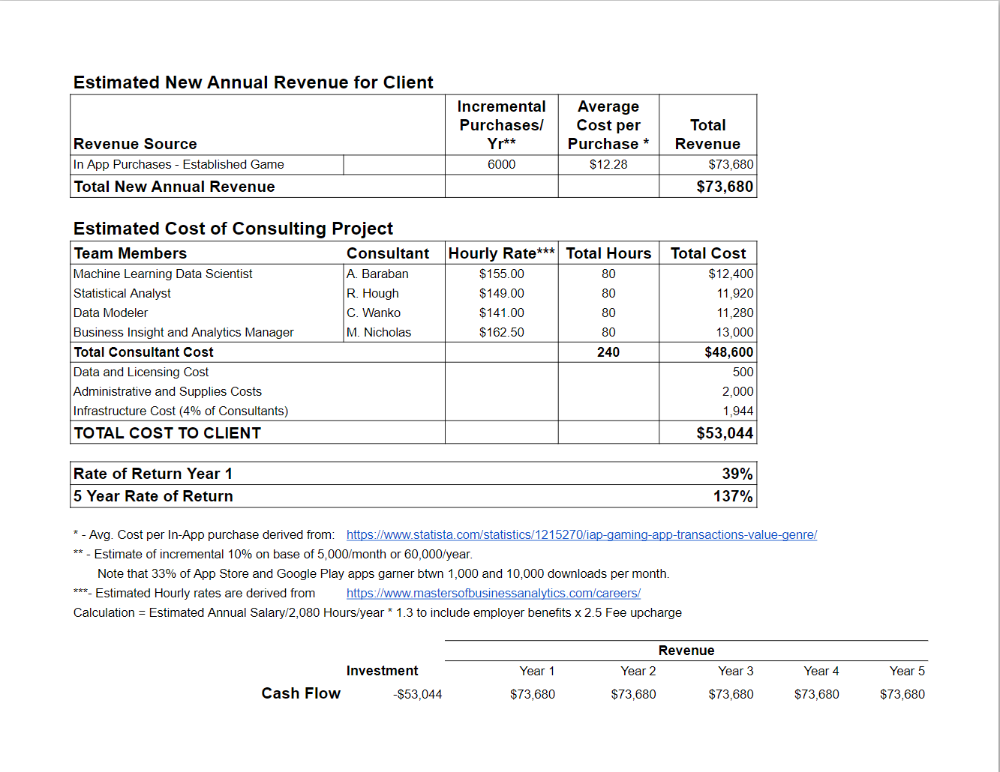

# CRAM Group
# :video_game: $PENDING :video_game:: In game purchase predictions

**Industry:** Online Services - Gaming\
**Project Type:** Research & Predicting Analysis\
**Date:** 09/11/2024\
**Authors:** Alexander Baraban, Ryan Hough, Michael Nicholas, Catherine Wanko\
**Contact:** alexbaraban17@gmail.com, hough.ryanj@gmail.com, mpnicholas21@gmail.com, catherine.twcr@gmail.com

---

## Table of Contents

1. [Project Overview](#project-overview)
2. [Main Objectives](#main-objectives)
3. [Data Sources](#data-sources)
4. [Research Questions](#research-questions)
5. [Methodology](#methodology)
6. [Team Roles and Responsibilities](#team-roles-and-responsibilities)
7. [Cost and ROI Estimation](#cost-and-roi-estimation)
8. [Challenges and Solutions](#challenges-and-solutions)
9. [Conclusion](#conclusion)
10. [Licensing and Legal Terms](#licensing-and-legal-terms)
11. [References](#references)

---

## Project Overview

The rise of online gaming has led to a significant increase in in-game purchases; a critical revenue model of many gaming companies. Understanding the features that influence a player's likelihood to make these purchases is essential for game developers and marketers. This research investigates the relationship between player metrics and demographics with the likelihood of making in-game purchases. The goal is to develop a predictive model that can assist game developers in enhancing engagement and maximizing revenue through targeted strategies.

---

## Main Objectives

The primary objectives of this research are: 

1. **Identify Key Features:**
   - Determine which features from the dataset had the highest predictive influence of in-app purchases. 
      - Age
      - Gender
      - Location
      - GameGenre
      - PlayTimeHours 
      - GameDifficulty 
      - Sessions Per Week
      - Average Duration Minutes
      - Player Level
      - Achievements Unlocked
2. **Develop Predictive Models:**
   - Logistic Regression
   - Random Forest
   - Support Vector Classifier
   - KNearest Neighbors
3. **Provide Strategic Recommendations:**
   - No recommendations specific to in-app purchases can be generated from this dataset.
   - Conduct a comprehensive Exploratory Data Analysis (EDA). 
   - Be alert for synthetically generated data. **Read more below!** 

---

## Data Sources

**Primary Data Source:**
- URL: [Predict Online Gaming Behavior Dataset](https://www.kaggle.com/datasets/rabieelkharoua/predict-online-gaming-behavior-dataset)  
  - Description: This dataset includes player behavior metrics and demographics related to online gaming.
  - Rationale: The dataset provides comprehensive data necessary to build and evaluate predictive models.

**Secondary Data Source:**
- People Cost Analysis (for ROI): [Masters of Business Analytics](https://www.mastersofbusinessanalytics.com/careers/)

---

## Research Questions

1. **Model Selection:** Which model type provides the best predictive capability for predicting in-game purchases?
   - **Answer:** N/A.  Please see Process Overview below, and evolution of model results leading to conclusion that data set was synthetic, and ultimately has no predictive value regardless of model used.
2. **Model Evaluation:** Are there risks related to overfitting or underfitting within the models that require further investigation?
   - **Answer:** There are "no" risks of related to underfitting, but the risks related to overfitting are poor results on new data, but in the end it doesn't matter because of the content of the data. 
3. **Model Confidence:** What further analysis ensures that the chosen model is the best fit for this project?
   - **Answer:** N/A *see additional information below regarding process overview and conclusions.*
4. **Influential Features:** With the chosen model, which features most significantly influence the likelihood of in-game purchases?
   - **Answer:** N/A *see additional information below regarding process overview and model conclusions.*
5. **Performance Metric:** Can the model achieve at least 75% classification accuracy or a 0.80 R-squared?
   - **Answer:** Yes, it certainly can! 

---

## Methodology

The project will use a combination of machine learning models, including K Nearest Neighbor, Logistic Regression, Random Forest, and SVM. Each model will be evaluated for its predictive performance, and the results will be compared to identify the best model for this specific problem. We will use scaled and unscaled data along with resampling methods in order to optimize the performance of our models. 

### Process Overview: 

1. **Data Pre-processing:** Clean and prepare the dataset for analysis.  
   - Data types and Null values were researched, and addressed to ensure that no null values existed and that data formats could be utilized or converted.
2. **EDA:** Inspect dataframe and data types of each feature. 
   - Once null values were confirmed to be zero, methods were built in a utils.py file to utilize for preprocessing each model.
   - The preprossing allowed for use of OrdinalEncoder to address feature sets such as Game Difficulty and Engagement Level.
   - OneHotEncoder was used to address feature sets such as Gender, Location, and Game Genre.
   - Also note the "Analysis" section below, identifying further EDA that was used to understand the validity of the data after encountering red flags.
3. **Model Development:** Load, evaluate, and optimize each predictive model. A random state of 7 was used for all models and resampling methods for reproducibility.
   - Alex Baraban built and evaluated Logistic Regression Model.
   - Ryan Hough built and eveluated K Nearest Neighbor model.
   - Catherine Wanko built and evaluated Support Vector Classifier model.
   - Mike Nicholas built and evaluated Random Forest Model.
5. **Analysis:** Perform data analysis to identify the best model.
   - During the evaluation process, the results were not improving on the test set, despite our attempts to perfect the models by changing parameters such as max_iter, n_estimators, and n_neighbors.
   - The confusion matrices helped us figure out that the model was only predicting the majority class which led us to a deep dive into the data.
   - This further data exploration, included creating a correlation matrix, demonstrated a zero correlation across almost all features within the data set, leading to a strong hypothesis that the data is synthetic.
   - Additional resarch within the Kaggle Data Set, and other analysis completed by users, showed other strong indicators of a synthetic data set, such as near uniform distributions across feature categories including age, difficulty, genre.  The data seemed too good to be true.  
6. **Visualization:** Create plots and graphs to visualize the performance of each model.
   - Most visualizations are included in the presentation, i.e. correlation matrix, and iterations of running 7 different variations for each model including:
      - **Base**: no scaling or resampling applied to features
      - **Scaled**: only scaling applied to features
      - **SMOTEENN**: with scaled features
      - **SMOTE**: with scaled features
      - **ClusterCentroids**: with scaled features
      - **RandomOverSampler**: with scaled features
      - **RandomUnderSampler**: with scaled features
   - The accuracies for each model and their respective variations are plotted against 'dummy' models and their accuracies. These models are:
      - **MostFrequentDummy**: Predicts the most frequent target class in the training set.
      - **StratifiedDummy**: Predicts target class according to the distribution of the training data.
      - **UniformDummy**: Predicts target classes equally among them, in this case there are two target classes (50/50 chance).
7. **Documentation:** Document the iterative changes and final results for each model.
   - See numbers 4 and 5 above, noting the iterative steps used to create the visualations that are documenting the impact of the changing and evolution of the model scenarios.
8. **Evaluation:**
   - We evaluated the models against the test data by using four different metrics: Accuracy score, balanced accuracy score, confusion matrices, and a classification report.
      - The confusion matrices helped us figure out that the model was only predicting the majority class, which in the end led us to our conclusion that this data is synthetic.
      - Only accuracy score was used in the graphs for non-technical audiences.
   - Assess the impact on ROI and provide strategic recommendations based on the findings.

---

## Team Roles and Responsibilities

### **Alexander Baraban**
**Responsibilities:**
- Collaborate on data set evaluation and agree on project objectives. 
- Set up the repository and prepare the initial README.md. 
- Data pre-processing and cleaning. 
- Create methods to streamline processes. 
- Load, evaluate and optimize the Logistic Regression model for predictive analysis. 
- Prepare appropriate plots or graphs for Logistic Regression model. 
- Perform data analysis related to the Logistic Regression model and collaborate with the team to agree conclusions as to whether Logistic Regression is the “best” model. 
- Document iterative changes to the Logistic Regression model and resulting change in performance in a CSV/Excel file or within the Python script itself. 
- Evaluate the cost of a Machine Learning Data Scientist for the project and its impact on ROI. 
- Contribute to the README.md documentation regarding code documentation, and usage and installation instructions. 
- Serve as a key presenter.

### **Ryan Hough**
**Responsibilities:**
- Collaborate on data set evaluation and agree on project objectives. 
- Design PowerPoint and other graphics/Logos. 
- Coordinate PowerPoint content. 
- Load, evaluate and optimize the K Nearest Neighbor model for predictive analysis. 
- Prepare appropriate plots or graphs for K Nearest Neighbor model 
- Perform data analysis related to the K Nearest Neighbor model and collaborate with the team to agree conclusions as to whether K Nearest Neighbor is the “best” model. 
- Document iterative changes to the K Nearest Neighbor model and resulting change in performance in a CSV/Excel file or within the Python script itself. 
- Evaluate the cost of a Statistical Analyst for the project and its impact on ROI. 
- Contribute to the README.md documentation regarding project overview and goals. 
- Serve as a key presenter.

### **Michael Nicholas**
**Responsibilities**
 - Serve team as Program Manager, leading coordination of all steps in the project. This includes, but is not limited to: Coordinating meeting cadence, Setting objectives for each meeting, creating milestones and time line goals, driving team-members to hold themselves accountable, Facilitating strategy evolution throughout the process, resolving conflict, and key point of contact and document submission to Instructor and TA.
 - Collaborate on data set evaluation and agree on project objectives. 
 - Coordinate the proposal document and submission. 
 - Load, evaluate and optimize the Random Forest model for predictive analysis.
 - Prepare appropriate plots or graphs for Random Forest model. 
 - Perform data analysis related to the Random Forest model and collaborate with the team to agree conclusions as to whether Random Forest is the “best” model. 
 - Document iterative changes to the Random Forest model and resulting change in performance in a CSV/Excel file or within the Python script itself.
 - Evaluate the cost of a Business Insight and Analytics Manager and resource/overhead costs for the project, and its impact on ROI. 
 - Prepare the Client ROI analysis, utilizing role analysis of team members. 
 - Contribute to the README.md documentation regarding results and summary 
 - Serve as a key presenter.

### **Catherine Wanko**
**Responsibilities**
 - Collaborate on data set evaluation and agree on project objectives. 
 - Review legal terms & conditions regarding data use/licensing and ensure team is compliant. 
 - Load, evaluate and optimize the SVM model for predictive analysis. 
 - Prepare appropriate plots or graphs for SVM model. 
 - Perform data analysis related to the SVM model and collaborate with the team to agree conclusions as to whether SVM is the “best” model. 
 - Document iterative changes to the SVM model and resulting change in performance in a CSV/Excel file or within the Python script itself. 
 - Evaluate the cost of a Data Modeler for the project and its impact on ROI. - Contribute to the README.md documentation regarding results, and compliance with legal licensing, Terms & Conditions. 
 - Serve as a key presenter. 

---

## Cost and ROI Estimation

**Internal Costs:**
- Statistical Analyst: $11,920.00
- Machine Learning Data Scientist: $12,400.00
- Business Insight and Analytics Manager: $13,000.00
- Data Modeler: $11,280.00

**Client ROI:**
- The project's estimated return on investment, assuming valid data, is provided below. 

---

## Challenges and Solutions

1. **Data Quality:**
   Once we realized the dataset was synthetic, we changed the focus of our project to educate others about the warning signs, and how to spot synthetic data.  

2. **Accuracy:** 
   Due to the nature of our unknown synthetic dataset, we experienced lack of predictive value in the evaluations. We confirmed that previous users of the dataset had generated similar results which led us to understand that our dataset was synthetic. We challenged the author of the dataset's validity, and within 24 hours the author posted a disclaimer that the data was synthetic. 

3. **Working with Synthetic Data:** 
   Didn't make any sense. Our models had no predictive power. In fact, the "Most Frequent Dummy" model predicted as well as the best of _any_ of our "real" models. The accuracy was diminished with applied methods that should have improved accuracy, such as, oversampling and undersampling. 

---

## Conclusion
 
In order to detect synthetic data, a comprehensive EDA must be conducted. Here are some red flags that may signal your data is synthetic. 
   - **Correlation Matrices**: Unnatural correlations between variables are a key sign. For example, an almost zero correlation between all variables (as in some synthetic datasets) or overly strong correlations between features and the target variable that enable too much predictive power. In real-life data, such extremes are uncommon.
   - **Distribution Analysis**: Analyzing the distributions of different variables may yield some insight as well. If the distribution of some variables seems _too_ good to be true, such as a near uniform or a very smooth normal distribution, the data is probably synthetic.
   - **Too much precision**: For variables that have to be measured, too much precision, or too many decimal places in the values may signal synthetic data.  

These are only a few of the red flags that synthetic data may raise and it is important to be on the lookout for them. Catching these warning signs is imperative in order to avoid wasting precious resources pursuing a lead that ended up being based off of synthetic data. We hope that our experience helps others spot synthetic data before it becomes an issue.

---

## Licensing and Legal Terms

The dataset licensed under the Creative Commons Attribution 4.0 International License (CC BY 4.0). The license allows us to share, copy, and redistribute the material in any medium or format, as well as adapt, remix, transform, and build upon the material for any purpose, even commercially. Appropriate credit should be provided with a link to the license. https://creativecommons.org/licenses/by/4.0/

---

## References

- [Predict Online Gaming Behavior Dataset](https://www.kaggle.com/datasets/rabieelkharoua/predict-online-gaming-behavior-dataset)
